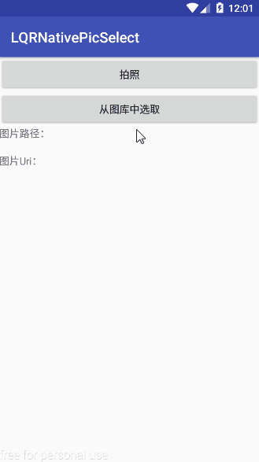

# 一、简述 

从 Android 7.0 开始，Android SDK 中的 StrictMode 策略禁止开发人员在应用外部公开 file:// URI。具体表现为，当我们在应用中使用包含 file:// URI 的 Intent 离开自己的应用时，程序会发生故障。本人根据网上给出的适配教程，成功在图片选择及拍照方面适配上了Android 7.0，并自己封装了一个工具类，为了今后开发更加快捷，于是本库就诞生了，如果你愿意使用本库的话，只需调用本库工具类中提供的3个方法(最少)，便可轻松完成拍照或图库选取图片的功能需求，且完全不需要考虑Android系统版本的问题，下面来看看如何使用本库。

# 二、使用

## 1、依赖与权限

### 1）依赖

	compile 'com.lqr.picselect:library:1.0.1'

### 2）权限

    <uses-permission android:name="android.permission.WRITE_EXTERNAL_STORAGE"/>
    <uses-permission android:name="android.permission.READ_EXTERNAL_STORAGE"/>
    <uses-permission android:name="android.permission.CAMERA"/>

## 2、代码调用

### 1）创建LQRPhotoSelectUtils
LQRPhotoSelectUtils提供了两个构造函数，分别是：

	// 可以自定义是否开启图片剪切功能（无法设置剪切大小，默认800*480）
	public LQRPhotoSelectUtils(Activity activity, PhotoSelectListener listener, boolean shouldCrop)
	// 默认开启图片剪切功能，可以指定剪切大小
	public LQRPhotoSelectUtils(Activity activity, PhotoSelectListener listener, int aspectX, int aspectY, int outputX, int outputY) 

>这里有两个要说明的：
>
>1. 部分国产机无法使用图片剪切功能，例如华为TAG-AL00就阉割了图片剪切，但本人亲测小米3就可以进行图片剪切，这是系统优化差异造成的，不是本库的问题！！！
>1. 此外，就算可以进行图片剪切，也不一定可以固定图片大小，亲测小米3与坚果pro无法固定剪切图片的大小，又因为手头上没有“谷歌亲儿子”，所以没法断定是不是本库代码问题，故在此，本人建议使用第一个构造方法。

使用第一个构造方法创建LQRPhotoSelectUtils对象示例如下：

	// 创建LQRPhotoSelectUtils（一个Activity对应一个LQRPhotoSelectUtils）
    mLqrPhotoSelectUtils = new LQRPhotoSelectUtils(this, new LQRPhotoSelectUtils.PhotoSelectListener() {
        @Override
        public void onFinish(File outputFile, Uri outputUri) {
            // 当拍照或从图库选取图片成功后回调
            mTvPath.setText(outputFile.getAbsolutePath());
            mTvUri.setText(outputUri.toString());
            Glide.with(MainActivity.this).load(outputUri).into(mIvPic);
        }
    }, true);

### 2）关联onActivityResult()

    @Override
    protected void onActivityResult(int requestCode, int resultCode, Intent data) {
        super.onActivityResult(requestCode, resultCode, data);
        // 在Activity中的onActivityResult()方法里与LQRPhotoSelectUtils关联
        mLqrPhotoSelectUtils.attachToActivityForResult(requestCode, resultCode, data);
    }

### 3）调用拍照或从图库选取图片方法

	// 调用相机进行拍照
	mLqrPhotoSelectUtils.takePhoto();
	// 调用图库选取图片
	mLqrPhotoSelectUtils.selectPhoto();

### 4）其他设置

	// 设置FileProvider的主机名
	mLqrPhotoSelectUtils.setAuthorities();
	// 修改图片的存储路径
    mLqrPhotoSelectUtils.setImgPath();

>注意：
>
>如果你app的build.gradle中，defaultConfig{}的applicationId对应的值不是应用包名的话就需要调用setAuthorities()方法;也设置FileProvider的主机名，这是为了适配Android 7.0。取值是applicationId对应的值+".fileprovider"。若applicationId对应的值是应用包名的话则不需理会。

## 4、效果

如有问题请参考本库的Demo，相信问题并不大，下面看下Demo的运行效果：

